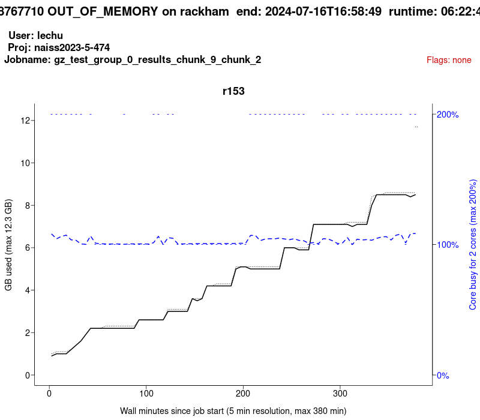

# ticket_296478

Notes and code for ticket 296478

## Suggested solution 1

Add to the job script:

```
#SBATCH -C mem256GB
```

## Code

User provided [code.R](code.R).

It seems the [MatrixEQTL package](https://cran.r-project.org/web/packages/MatrixEQTL/index.html) is the workhorse.

Paper can be found [here](https://www.ncbi.nlm.nih.gov/pmc/articles/PMC3348564/).

The paper mentions memory in section 3.1

> The number of tests in a modern eQTL study may exceed tens of billions and the full correlation matrix GST would require hundreds of gigabytes of RAM. 
> To avoid excessive memory requirements we slice the data matrices in blocks of up to 10 000 variables and perform the analysis separately for each pair of blocks

If blocks are 10k times 10k, this denotes 100M cells. The size of the cell in bytes is unknown. Assuming a cell is 64 bit, hence 8 byte, a block costs 800MB of RAM,
which is way lower than the problematic 11.7 GB.

## Problem with job 48767710

```bash
finishedjobinfo -j 48767710
```

gives

```
2024-07-16 16:58:49 jobid=48767710 jobstate=OUT_OF_MEMORY username=lechu account=naiss2023-5-474 nodes=r153 procs=2 partition=core qos=normal jobname=gz_test_group_0_results_chunk_9_chunk_2 maxmemory_in_GiB=11.7 maxmemory_node=r153 timelimit=3-00:10:00 submit_time=2024-07-16T10:21:23 start_time=2024-07-16T10:36:09 end_time=2024-07-16T16:58:49 runtime=06:22:40 margin=2-17:47:20 queuetime=00:14:46
```

An 'out of memory' error, clearly and how to get more memory is described [here](https://docs.uppmax.uu.se/cluster_guides/slurm/#more-memory)

Node r153, according to [the Rackham hardware table](https://docs.uppmax.uu.se/hardware/clusters/rackham/#rackham-hardware)
is a one of 20 (2 x 10) with 128GB memory. 
I ignore the '2 x 10', because the user's program crashed at 11.7 GB memory usage,
which is more than (will have 128 / 20 =) 6.4 GB (and less than 128 / 10 = 12.8 GB).

```
[richel@rackham1 richel]$ jobstats --plot 48767710
Running '/sw/uppmax/bin/finishedjobinfo -M rackham -j 48767710' for more information, please be patient...
48767710	rackham	OUT_OF_MEMORY	lechu	naiss2023-5-474	'gz_test_group_0_results_chunk_9_chunk_2'	2024-07-16T16:58:49	06:22:40	.	2	11.7	2	r153	/sw/share/slurm/rackham/extended_uppmax_jobstats/r153/48767710
*** 1 total jobs
*** 1 jobs run, 0 jobs not run
```

Then

```
eog rackham-naiss2023-5-474-lechu-48767710.png
```

gives:



Judging from the graph, the user seems to have 12.8 GB, hence '2 x 10' means 10x a duocore processor.

As I do not have the user's batch script, it seems to me that the user could try to add to the batch script:

- `-C mem256GB` 
- `-C mem1TB`


